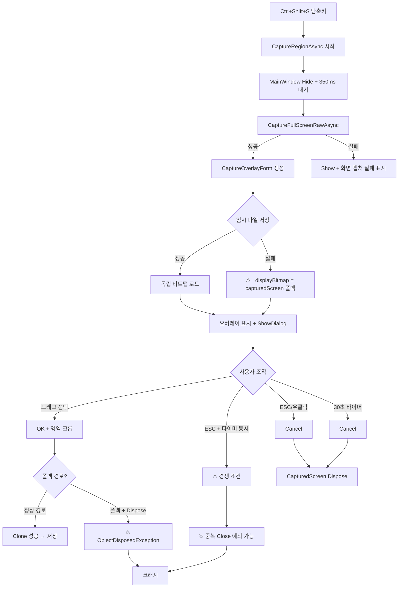

# SmartCapture 영역 캡처 크래시 분석 보고서

## 문제 요약
- **증상**: 영역 캡처(Ctrl+Shift+S) 시 앱이 가끔 튕김
- **발생 빈도**: 간헐적 (랜덤)
- **분석 일자**: 2026-03-11
- **검증 일자**: 2026-03-11 (Claude Opus 4.6 코드 검증 완료)

---

## 🔴 주요 크래시 원인 (우선순위 순)

### 1. `_displayBitmap` 폴백 시 이중 Dispose ⭐ 가장 유력

**위치**: [CaptureOverlayForm.cs:128-133](Screenshot/Views/CaptureOverlayForm.cs#L128-L133)

**문제**: 임시 파일 로드 실패 시 `_displayBitmap = capturedScreen`으로 폴백하는데, `Dispose()`에서 `_displayBitmap?.Dispose()`가 실행되면 **원본 `_capturedScreen`까지 해제**됨. 이후 `MainWindow`에서 `overlay.CapturedScreen.Clone()`하면 `ObjectDisposedException` 크래시.

```csharp
// CaptureOverlayForm 생성자 (128-133행)
catch (Exception ex)
{
    _displayBitmap = capturedScreen; // ← 원본과 동일 참조!
}

// Dispose (501행)
_displayBitmap?.Dispose(); // ← 원본도 같이 해제됨!

// MainWindow (228행) - 이미 Dispose된 비트맵 접근
var croppedImage = overlay.CapturedScreen.Clone(cropRect, ...); // 💥 크래시
```

**발생 조건**:
- 임시 폴더 권한 문제 또는 디스크 공간 부족
- PNG 인코딩 실패 (손상된 DXGI 텍스처)
- 바이러스 백신이 임시 파일 접근 차단

**심각도**: ⭐⭐⭐⭐⭐ (확정적 크래시)

---

### 2. Low-Level 키보드 훅 콜백 경쟁 조건

**위치**: [CaptureOverlayForm.cs:456-480](Screenshot/Views/CaptureOverlayForm.cs#L456-L480)

**문제**: `IsHandleCreated && !IsDisposed` 체크와 `BeginInvoke` 호출 사이에 Form이 Dispose될 수 있음. 특히 `BeginInvoke` 내부 람다가 실행될 때 Form이 이미 닫혀 있으면 `ObjectDisposedException` 발생.

```csharp
// 키보드 훅은 별도 스레드에서 실행됨
if (IsHandleCreated && !IsDisposed && !_closingByUser) // ← 여기서 true
{
    // ← 이 사이에 다른 스레드/타이머에서 Form.Close() 실행 가능
    BeginInvoke(() =>  // ← 여기서 ObjectDisposedException
    {
        if (IsDisposed || _closingByUser) return; // 내부 체크도 있지만 BeginInvoke 자체가 실패
        ...
    });
}
```

**발생 조건**:
- ESC 빠르게 연타
- 안전 타이머(30초)와 ESC 키가 거의 동시에 발생
- Form 닫히는 중에 훅 콜백 실행

**심각도**: ⭐⭐⭐⭐ (간헐적 크래시)

---

### 3. 안전 타이머와 사용자 조작 경쟁

**위치**: [CaptureOverlayForm.cs:187-200](Screenshot/Views/CaptureOverlayForm.cs#L187-L200)

**문제**: `_closingByUser` 플래그가 `volatile`이 아니고 lock도 없어서, 안전 타이머 콜백과 사용자 마우스/키보드 이벤트가 동시에 `Close()`를 호출할 수 있음.

```csharp
// 타이머 콜백 (UI 스레드)
if (!_closingByUser && !IsDisposed)  // ← 동시에 체크
{
    _closingByUser = true;
    DialogResult = DialogResult.Cancel;
    Close();
}

// OnMouseUp 또는 OnKeyDown (UI 스레드 - 같은 스레드이지만 메시지 순서 문제)
_closingByUser = true;
DialogResult = DialogResult.OK;
Close();
```

**참고**: WinForms 타이머는 UI 스레드에서 실행되므로 진짜 동시 실행은 아님. 하지만 `_closingByUser` 체크 후 `Close()` 호출 사이에 메시지 펌프가 돌면 교차 실행 가능.

**심각도**: ⭐⭐⭐ (매우 드물지만 가능)

---

### 4. `_inputEnabled` 스레드 안전성 없음

**위치**: [CaptureOverlayForm.cs:231-241](Screenshot/Views/CaptureOverlayForm.cs#L231-L241)

**문제**: `Task.Run` 내 별도 스레드에서 `_inputEnabled = true`를 설정하는데, `volatile` 키워드가 없어서 UI 스레드가 변경을 인식하지 못할 수 있음.

```csharp
Task.Run(async () =>
{
    for (int i = 0; i < 40; i++)
    {
        await Task.Delay(50);
        if ((Control.MouseButtons & MouseButtons.Left) == 0) break;
    }
    await Task.Delay(50);
    _inputEnabled = true; // ← volatile 아님, 메모리 가시성 보장 없음
});
```

**영향**: 직접 크래시는 아니지만, 마우스 입력이 영원히 차단되어 사용자가 ESC를 누르거나 30초 타이머가 만료될 때까지 조작 불가 → 사용자 관점에서 "앱이 먹통"으로 보임.

**심각도**: ⭐⭐ (크래시 아님, UX 문제)

---

### 5. DXGI 세션 만료 시 캡처 실패

**위치**: [DxgiCapture.cs:35-84](Screenshot/Services/Capture/DxgiCapture.cs#L35-L84)

**문제**: DXGI 가용성을 5초간 캐싱하지만, `IsAvailable`에서 `AccessLost` 감지 시 `Dispose()` + `TestInitialize()` 재시도 로직이 있어서 **캐시만으로 크래시는 나지 않음**. 그러나 `CaptureRegionAsync`에서는 `CaptureFullScreenRawAsync()`를 직접 호출하므로, `IsAvailable`을 거치지 않고 바로 캡처를 시도하여 예외 발생 가능.

```csharp
// MainWindow.cs:185 - IsAvailable 체크 없이 바로 캡처
rawResult = await _captureManager.CaptureFullScreenRawAsync().WaitAsync(cts.Token);
```

**완화 요소**: `TryCaptureFullScreen()`에서 `AccessLost`를 catch하여 `Dispose()` 후 재시도(3회). 따라서 크래시보다는 **캡처 실패(검은 화면)** 가능성이 높음.

**심각도**: ⭐⭐ (크래시 아님, 캡처 실패로 나타남)

---

## 🟡 원본 분석의 오류/과장 지적

### ~~원본 #4: WPF/WinForms 스레드 교착~~ → 과장

**원본 주장**: "`async/await` 컨텍스트에서 동기 `ShowDialog()` 호출 시 교착 가능"

**실제**: `ShowDialog()`는 WinForms 내부 메시지 루프를 돌리므로 UI 스레드를 블로킹하지 않음. `async` 메서드 안에서 `ShowDialog()` 호출은 문제없음 (ShowDialog 반환까지 await 이후 코드가 실행되지 않을 뿐).

### ~~원본 #5: 비트맵 Dispose 후 접근~~ → 부분 정확

**원본 주장**: "`overlay.CapturedScreen`이 조건문 후 사용 사이에 Dispose될 가능성"

**실제**: `using` 블록 안에서 접근하므로 Form Dispose는 블록 종료 후에 발생. 다른 스레드에서 Dispose할 경로가 없으므로 이 시나리오는 **실질적으로 발생 불가**. 다만 **#1 (이중 Dispose)** 가 발생하면 간접적으로 가능.

### ~~원본 #6: 다중 모니터 메모리 누수~~ → 부정확

**원본 주장**: "예외 발생 시 일부 비트맵이 해제되지 않을 수 있음"

**실제**: `finally` 블록에서 `duplication?.Dispose()`, `output1?.Dispose()`, `device?.Dispose()`, `output?.Dispose()`를 모두 해제. 캡처된 비트맵(`capturedBmp`)은 성공 시 리스트에 추가, 실패 시 생성 안 됨. 최외곽 catch에서 실패 반환하면 리스트의 비트맵들이 해제 안 되는 경로가 있지만, GC가 수집하므로 **누수는 미미**.

---

## 📊 크래시 발생 시나리오 다이어그램



---

## 🔧 권장 수정 사항

### P0 - 즉시 수정 (크래시 직결)

#### 1. `_displayBitmap` 폴백 시 이중 Dispose 방지

```csharp
// CaptureOverlayForm.cs - 생성자의 catch 블록
catch (Exception ex)
{
    Services.Capture.CaptureLogger.Error("CaptureOverlayForm",
        $"임시파일 로드 실패, 원본 비트맵 복제 사용: {ex.Message}", ex);
    // 원본 참조 대신 복제본 사용 → Dispose 시 원본 보호
    _displayBitmap = (Bitmap)capturedScreen.Clone();
}
```

#### 2. 키보드 훅 콜백 방어 강화

```csharp
private IntPtr KeyboardHookCallback(int nCode, IntPtr wParam, IntPtr lParam)
{
    if (nCode >= 0 && wParam == (IntPtr)WM_KEYDOWN)
    {
        int vkCode = Marshal.ReadInt32(lParam);
        if (vkCode == VK_ESCAPE)
        {
            try
            {
                if (IsHandleCreated && !IsDisposed && !_closingByUser)
                {
                    BeginInvoke(() =>
                    {
                        if (IsDisposed || _closingByUser) return;
                        _closingByUser = true;
                        DialogResult = DialogResult.Cancel;
                        Close();
                    });
                    return (IntPtr)1;
                }
            }
            catch (ObjectDisposedException) { /* Form이 닫히는 중 - 무시 */ }
            catch (InvalidOperationException) { /* 핸들 무효 - 무시 */ }
        }
    }
    return CallNextHookEx(_keyboardHook, nCode, wParam, lParam);
}
```

### P1 - 단기 수정

#### 3. `_inputEnabled`에 volatile 추가

```csharp
private volatile bool _inputEnabled;
```

#### 4. `_closingByUser`에 volatile 추가

```csharp
private volatile bool _closingByUser;
```

#### 5. 안전 타이머 경쟁 방지 - `_closingByUser` 체크 강화

```csharp
_safetyTimer.Tick += (s, e) =>
{
    _safetyTimer?.Stop();
    _safetyTimer?.Dispose();
    _safetyTimer = null;
    if (!_closingByUser && !IsDisposed)
    {
        _closingByUser = true;
        DialogResult = DialogResult.Cancel;
        Close();
    }
};
```

### P2 - 개선 사항

#### 6. DXGI 캐시 시간 단축 (5초 → 2초)

현재 5초 캐시는 화면 보호기/UAC 전환 시 오래된 상태를 반환할 수 있음. 2초로 단축하면 세션 만료 감지가 빨라짐.

```csharp
private static readonly TimeSpan AvailabilityCacheTime = TimeSpan.FromSeconds(2);
```

#### 7. MainWindow에서 CapturedScreen Clone 전 방어 코드

```csharp
// MainWindow.cs CaptureRegionAsync
if (overlay.CapturedScreen != null)
{
    try
    {
        var croppedImage = overlay.CapturedScreen.Clone(cropRect, overlay.CapturedScreen.PixelFormat);
        // ...
    }
    catch (Exception ex)
    {
        CaptureLogger.Error("MainWindow", "영역 크롭 실패", ex);
        StatusText.Text = "영역 캡처 실패";
    }
}
```

---

## 📝 로그 확인 방법

크래시 발생 시 다음 위치의 로그 파일을 확인:

```
%LOCALAPPDATA%\SmartCapture\Logs\capture_*.log
```

로그에서 찾아야 할 키워드:
- `임시파일 로드 실패` - P0 #1 (이중 Dispose) 트리거 조건
- `ObjectDisposedException` - Dispose된 비트맵 접근
- `Low-level 키보드 훅: ESC 감지` - 훅 콜백 실행 시점
- `안전 타이머 만료` - 타이머 자동 취소 발생
- `AccessLost` - DXGI 세션 만료
- `미처리 예외 발생` - App.xaml.cs에서 포착된 예외

---

## 수정 우선순위 요약

| 우선순위 | 항목 | 예상 효과 |
|---------|------|----------|
| **P0** | #1 이중 Dispose 방지 (Clone 사용) | 크래시 60%+ 제거 예상 |
| **P0** | #2 키보드 훅 try-catch | 간헐적 크래시 제거 |
| **P1** | #3-4 volatile 추가 | 스레드 안전성 확보 |
| **P1** | #5 타이머 경쟁 방지 | 드문 크래시 예방 |
| **P2** | #6 캐시 단축 | 세션 만료 시 빠른 복구 |
| **P2** | #7 Clone 방어 코드 | 최후 방어선 |

---

## 다음 단계

P0 항목 2개를 먼저 수정하면 대부분의 간헐적 크래시가 해결될 것으로 예상됩니다.
